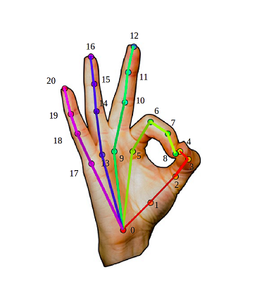

# Detector de mão

## Descrição 

Repositório criado para resolver o desafio de desenvolver um serviço que rode no navegador para detecção de mão, com o principal objetivo de predizer o ângulo theta, entre os pontos 8 e 4(imagem abaixo), em tempo real. O serviço foi criado utilizando Javascript/Typescript e teve como base a aplicação demo [Handpose](https://github.com/tensorflow/tfjs-models/tree/master/handpose)

 
  

## Pré-requisitos

* Instalar [MediaPipe](https://google.github.io/mediapipe/getting_started/install.html)

## Build

Entre na pasta:

```sh
cd Detector
```

Instale as dependências e prepare o diretório:

```sh
yarn
```
Para observar as alterações nos arquivos e iniciar um servidor:

```sh
yarn watch
```

Abra o servidor na porta indicada, Exemplo:
```sh
http://localhost:1234
```


